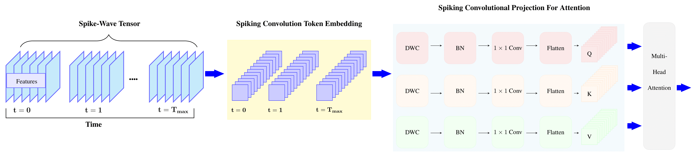

# Spiking-Convolutional-Vision-Transformer
This repository presents the implementation of `SCvT` model from the paper Spiking Convolutional Vision Transformer (under review).


## Install
We used python 3.8 to run this code. To install all requirements via pip:
```bash
$ pip install -r requirements.txt
```

## Data:


## Train the model
To train the model, you can run: 


